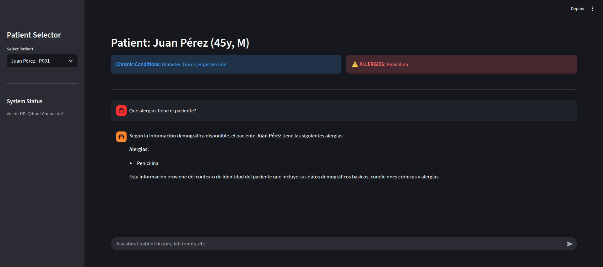

# Clinical Assistant RAG (EHR-Driven)



A Proof-of-Concept medical assistant powered by Retrieval-Augmented Generation (RAG) for querying Electronic Health Records (EHR). Built with semantic search, LLM-based reasoning, and real-time patient data retrieval.

## **NOTE**: 
Multiple aspects of this project where adapte given the data that has been provided. In the following section I'll mention which parts and what would I do different with proper circunstances:

- **JSON data sources:** If we are obtaining JSONs files from requesting structured databases, I would try to get the demographic and the medical_history directly from the DB using a proper tools instead of using RAG at all because this structured data is TOO IMPORTANT to consider the possibility to even miss it. That's also why on my solution I injected it directly into context from start as well as showing it to the users directly to reduce the margin of error to the minimum.
  Also, if the info is always this structured, RAG struggles with structured data because it doesnt understand structure but context which natural sentences provides, JSONs files dont. That's why I'll also probably add a tool to search lab_results directly from the data source rather than from RAG, because, for example, RAG and vectorDB are not good for time oriented questions like "Last 3 lab results", and that's where traditional DBs shine.
  What I would find value in ingesting in a vectorDB would be the recent_visits, because that way we can lookup doctor notes related to certain topic in a given time range or doctor. Otherwise, it will probably still be better to simply retrieved it using conventional datasources if we are not searching for anything based on the doctor notes.

- **Data governance**: If the users need extreme discretion and anonymity, we can even use Microsoft Presidio which removes PII (Personal Identifiable Information) from the queries ad change it to tags that when the response is received are changed back to the original text to maximize data security.

- **Async tool calling**: This project doesnt implement this but a proper project would include something similar to a "planning" phase so we query all the needed information async at the same time to maximize response speed. If information were still mising, another round would happen before answering the user query. 

- **Model selection**: I used Deepseek for easily solve this because I had credits in my personal API key. In a real world scenario, in case you wanted the medics to have an medic assistant AI instead of a natural language chat that simply retrieves and answer the user question based on the patient case, this model might be overkill, BUT, honestly, Deepseek is so good and sooo cheap that, unless we are gonna use some really small model (which in that case we should probably do fine tuning to make sure the small model performs great if proven needed based on the model weights and performance) or a self hosted solution, then, I would really recommend the use of Deepseek based on price/quality balance.

## 🏗️ Architecture

```
┌─────────────────────────────────────────────────────────────────┐
│                         Streamlit UI                             │
│  (Patient Selector | Identity Banner | Chat Interface)          │
└───────────────────────┬─────────────────────────────────────────┘
                        │
                        ├─────────────────────────────────────────┐
                        │                                         │
                        ▼                                         ▼
┌───────────────────────────────┐                   ┌───────────────────────────────┐
│   Patient JSON Files         │                   │   Clinical Assistant Agent   │
│   (data/*.json)              │                   │   (LangChain + DeepSeek)      │
│   - demographics             │                   │                               │
│   - medical_history          │◄──────────────────│   System Prompt + Tools       │
│   - recent_visits            │                   │   - medical_search_tool       │
│   - lab_results              │                   │                               │
└───────────────────────────────┘                   └───────────────┬───────────────┘
                        │                                         │
                        ▼                                         ▼
┌───────────────────────────────┐                   ┌───────────────────────────────┐
│   Ingestion Pipeline          │                   │   MedicalVectorStore         │
│   (scripts/ingest_data.py)    │                   │   (Qdrant + Voyage AI)       │
│   - JSON parsing              │                   │                               │
│   - Narrative transformation  │───┐               │   - 512-dim embeddings       │
│   - Chunk generation          │   │               │   - Cosine similarity        │
│   - Vector embeddings         │   │               │   - Patient filtering        │
└───────────────────────────────┘   │               │   - Event type filtering     │
                                     │               │   - Date ordering             │
                                     │               └───────────────────────────────┘
                                     ▼
┌─────────────────────────────────────────────────────────────────┐
│                    Vector Database (Qdrant)                     │
│  Collection: medical_records                                     │
│  - Vector dimension: 512                                         │
│  - Distance: Cosine                                             │
│  - Payload indexes: patient_id, event_type, timestamp          │
│  - Deterministic UUIDs (UUID v5)                                 │
└─────────────────────────────────────────────────────────────────┘
```

## 🔧 Technical Decisions

### 1. **Voyage AI (voyage-3.5) for Embeddings**

**Decision**: Use Voyage AI's `voyage-3.5` model with 512 dimensions for vector embeddings

**Rationale**:

- To be clear, the only reason of why I don't use voyage-3.5-lite is because I ran out of free credits, otherwise I would use it for sure.
- Multilingual model.
- Optimized for healthcare terminology and medical concepts
- 512 dimensions provides good balance between performance and storage. Because we filter per patient, there's no need to actually use such an advanced or expensive embedding model.
- State of the art embedding model securing accuracy at a good cost.

**Alternatives Considered**:

- OpenAI `text-embedding-3-small` (512 dim): General-purpose
- OpenAI `text-embedding-3-large` (3072 dim): Overkill, expensive

### 2. **DeepSeek-Chat as the LLM model**

**Decision**: Use DeepSeek-Chat as the LLM, accessed langchain_deepseek

**Rationale**:

- Cost-effective compared to literally any other model. Except probably small self host LLms
- Strong reasoning capabilities for clinical tasks
- Temperature=0 ensures consistent, factual responses critical for medical use

### 3. **Qdrant for Vector Database**

**Decision**: Use Qdrant as the vector database backend. Honestly that's because that's the Vector DB that I am most familiar with.

**Rationale**:

- Native Python client with clean API
- Excellent filtering capabilities with payload indexes
- Efficient similarity search with cosine distance
- Docker-based deployment for easy setup
- In-memory persistence via volume mounting
- Supports deterministic UUIDs for point deduplication

**Key Features Used**:

- Payload indexes on `patient_id`, `event_type`, `timestamp`
- Cosine distance for semantic similarity
- Deterministic UUID v5 for reproducible point IDs

### 4. **Identity vs. Event Data Separation**

**Decision**: Split patient data into static (identity) and dynamic (events) categories. Also, the reason WHY we added a patient selection instead of dynamically retrieve it will be further discussed in the interview but long story short, using only full name to retrieve the user is not enough and retrieving the wrong user in the medical field can be potencially letal. Problem is, using IDs to retrieve them affects accessibility and use access, so, we should try to automate based on schedule time and if needed, select/provide in chat the ID with confirmation to avoid this fatal mistake. 

**Rationale**:

- **Identity Context** (demographics, allergies, conditions, medications): Always present in system prompt for immediate reference
- **Event Data** (visits, labs): Retrieved on-demand via semantic search
- Reduces context window usage
- Ensures critical safety information (allergies) is always visible
- Enables efficient retrieval of relevant historical events

**Implementation**:

```python
identity_context = {
    "demographics": {...},  # Always in context
    "medical_history": {
        "chronic_conditions": [...],
        "allergies": [...],  # Critical safety info
        "current_medications": [...]
    }
}

# Events retrieved via tool
events = medical_search_tool(query="diabetes management", event_type="visit")
```

### 5. **Atomic Event Chunking**

**Decision**: Index each visit and lab result as a separate vector chunk

**Rationale**:

- Enables precise retrieval of specific clinical events
- Better semantic matching at event granularity
- Allows filtering by event type (visit vs lab)
- Facilitates chronological ordering for temporal queries

**Narrative Format**:

```python
# Visit: DATE | DOCTOR | REASON | NOTES
"DATE: 2024-10-15 | DOCTOR: Dra. Martínez | REASON: Control rutinario | NOTES: Glucosa en ayunas: 128 mg/dL..."

# Lab: DATE | TEST | RESULTS
"DATE: 2024-10-10 | TEST: Panel metabólico | glucose: 128 mg/dL | hba1c: 7.2%..."
```

### 6. **Tool-Based Agent Architecture**

**Decision**: Implement LangChain agent with `medical_search_tool` for all historical queries

**Rationale**:

- Enforces disciplined retrieval - agent cannot hallucinate event data
- Clear separation of capabilities (static context vs. search)
- Enables transparent tool calls for audit trail
- Structured interface with validation (event_type must be 'visit' or 'lab')
- Date ordering option for temporal queries

**Tool Schema**:

```python
class MedicalSearchSchema(BaseModel):
    query: str  # Semantic search query
    event_type: str  # REQUIRED: 'visit' or 'lab'
    order_by_date: bool  # True for "most recent" queries
```

### 7. **Deterministic UUID v5 for Point IDs**

**Decision**: Use UUID v5 with namespace-based generation for vector point IDs

**Rationale**:

- Reproducible point IDs from same input data
- Enables idempotent upserts (same data = same ID)
- Prevents duplicate entries on re-ingestion
- Namespace-based collision avoidance across patients

**Implementation**:

```python
NAMESPACE_MEDICAL = uuid.UUID("6ba7b810-9dad-11d1-80b4-00c04fd430c8")
point_id = uuid.uuid5(NAMESPACE_MEDICAL, f"{patient_id}_{internal_id}")
```

### 8. **Payload Indexes for Efficient Filtering**

**Decision**: Create indexes on `patient_id`, `event_type`, and `timestamp` fields

**Rationale**:

- Enables efficient patient-scoped searches
- Supports event type filtering without full scans
- Allows chronological sorting without post-processing
- Critical for multi-patient system scalability

## 🚀 Getting Started

### Prerequisites

- Python 3.10 or higher
- Docker and Docker Compose
- API keys for DeepSeek and Voyage AI

### Installation

#### 1. Clone the Repository

```bash
git clone <repository-url>
cd huli-project-medical-RAG
```

#### 2. Create Virtual Environment

```bash
python -m venv .venv
source .venv/bin/activate  # On Windows: .venv\Scripts\activate
```

#### 3. Install Dependencies

```bash
pip install -r requirements.txt
```

#### 4. Configure Environment Variables

```bash
cp .env.example .env
```

Edit `.env` and add your API keys:

```env
DEEPSEEK_API_KEY=your_deepseek_api_key_here
VOYAGE_API_KEY=your_voyage_api_key_here
QDRANT_URL=http://localhost:6333
```

#### 5. Start Qdrant (Vector Database)

```bash
docker-compose up -d
```

Verify Qdrant is running:

```bash
curl http://localhost:6333/collections
```

#### 6. Initial Data Ingestion (First Run Only)

```bash
python scripts/ingest_data.py
```

Expected output:

```
🚀 Starting First Run Ingestion...
Checking collection 'medical_records'...
Collection exists. Recreating it to ensure 512-dimension configuration...
📄 Processing patient_1.json...
✅ Ingested 3 chunks for Juan Pérez
📄 Processing patient_2.json...
✅ Ingested 4 chunks for María González

✨ First run ingestion complete! Your Vector DB is ready.
```

#### 7. Run the Application

```bash
streamlit run ui/app.py
```

The application will open at `http://localhost:8501`

## 📁 Project Structure

```
huli-project-medical-RAG/
├── core/
│   ├── agent.py              # LangChain agent with medical search tool
│   └── vector_store.py       # Qdrant integration + Voyage embeddings
├── utils/
│   └── narrative.py          # Data transformation to narrative format
├── ui/
│   └── app.py                # Streamlit web interface
├── scripts/
│   └── ingest_data.py       # ETL pipeline for vector DB ingestion
├── data/
│   ├── patient_1.json        # Sample patient data
│   ├── patient_2.json        # Sample patient data
│   └── example.json          # Data format template
├── qdrant_storage/           # Persisted vector data (Docker volume)
├── .env.example              # Environment variables template
├── requirements.txt          # Python dependencies
├── docker-compose.yml        # Qdrant container configuration
└── README.md                 # This file
```

## 🔍 Key Components

### MedicalVectorStore (`core/vector_store.py`)

- Manages Qdrant client connection
- Generates embeddings via Voyage AI
- Creates and configures collections with payload indexes
- Provides search with patient filtering and event type filtering

### ClinicalAssistant (`core/agent.py`)

- Creates LangChain agent with DeepSeek LLM
- Implements `medical_search_tool` for historical queries
- Constructs system prompts with identity context
- Manages agent execution with thread-based context

### Narrative Utils (`utils/narrative.py`)

- Transforms structured JSON to narrative format
- Converts visits: `DATE | DOCTOR | REASON | NOTES`
- Converts labs: `DATE | TEST | RESULTS`
- Generates metadata for vector payloads

### Streamlit UI (`ui/app.py`)

- Patient selection sidebar
- Identity context banner
- Chat interface with message history
- Tool call visualization
- Real-time streaming responses

### Ingestion Script (`scripts/ingest_data.py`)

- Processes all JSON files in `data/` directory
- Transforms data to narrative format
- Generates embeddings and upserts to Qdrant
- Handles collection recreation for dimension updates

## 📝 Data Format

### Patient JSON Structure

```json
{
  "patient_id": "P001",
  "demographics": {
    "name": "Juan Pérez",
    "age": 45,
    "gender": "M",
    "blood_type": "O+"
  },
  "medical_history": {
    "chronic_conditions": ["Diabetes Tipo 2", "Hipertensión"],
    "allergies": ["Penicilina"],
    "current_medications": [
      {
        "name": "Metformina",
        "dose": "850mg",
        "frequency": "2x/día"
      }
    ]
  },
  "recent_visits": [
    {
      "date": "2024-10-15",
      "reason": "Control rutinario",
      "notes": "Glucosa en ayunas: 128 mg/dL...",
      "doctor": "Dra. Martínez",
      "visit_id": "V001"
    }
  ],
  "lab_results": [
    {
      "date": "2024-10-10",
      "test": "Panel metabólico",
      "results": {
        "glucose": "128 mg/dL",
        "hba1c": "7.2%"
      },
      "lab_id": "L001"
    }
  ]
}
```
